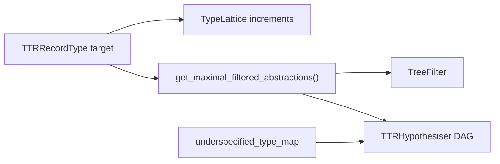

# Induction code extension tips/checklist

A list of things that were changed after the generation work for babyDS induction -> For CHILDES/WCP, we might need to revert/combine some of these changes.

| Concern | Actual location (main) | Role |
|--------|-------------------------|------|
| **Argument-position templates** (node address → `subj`/`obj`/`ind_obj` field pattern) | [`src/dylan/induction/em_learner/tree_filter.py`](../src/dylan/induction/em_learner/tree_filter.py) — `TreeFilter._node_field_map` in `TreeFilter.init()` | Used by [`TTRRecordType.get_filtered_abstractions`](../src/dylan/formula/ttr_record_type.py) via `TreeFilter(self).filter(...)` to accept/reject abstraction **trees** |
| **Lattice priority bias** (which target fields seed increments first) | [`src/dylan/dag/type_lattice.py`](../src/dylan/dag/type_lattice.py) — `priority_templates` / `priority_fields` in `init_templates()` / `init_priority_fields()` | Traversal order in [`TTRHypothesiser`](../src/dylan/induction/em_learner/ttr_hypothesiser.py), not tree-shape filtering |
| **Which DSType peels to try** | [`src/dylan/formula/ttr_record_type.py`](../src/dylan/formula/ttr_record_type.py) — lists inside `get_filtered_abstractions` (`e>(e>(e>t))`, `e>(e>t)`, `e>t`; `cn>cn`) | Must stay aligned with tree arity and `TreeFilter` node paths |
| **Underspecified tree formulae** (Java `Tree` static `typeMap`) | [`src/dylan/tree/underspecified_type_map.py`](../src/dylan/tree/underspecified_type_map.py) | Default record shapes when building induction trees |

Lattice priority templates reuse the same `subj`/`obj`/`ind_obj` names; they are a second copy, not the tree filter. On main, `TreeFilter.init()` assigns address `00` twice, so the effective BabyDS map is **obj@00**, obj@010, ind_obj@0110.

[`TTRHypothesiser.initialise`](../src/dylan/induction/em_learner/ttr_hypothesiser.py) calls `get_maximal_filtered_abstractions`, which delegates to `get_filtered_abstractions`.

- **RT pairs:** `TTRRecordType.get_abstractions_basic` — field-type branches at the start of the loop (`cn` restrictor / `cn` / `t`, then `t`, else `f.ds_type == basic`).
- **Trees:** `TTRFormula.get_abstractions` in [`ttr_formula.py`](../src/dylan/formula/ttr_formula.py) — functional type to decorated tree (`get_types_subj_first`, `_abstractions_from_types`).
- **Filtered:** `get_filtered_abstractions` / `get_maximal_filtered_abstractions` (AA) — template list + `TreeFilter`. Fixtures: [`tests/formula/test_ttr_record_type.py`](../tests/formula/test_ttr_record_type.py).

**CHILDES-TEST** (not on main). Coupled knobs live in `src/dylan/induction/corpus_profile.py` (`InductionCorpusProfile`): `tree_filter_map`, `priority_template_specs` / `priority_field_specs`, `filtered_abstraction_templates_t` / `_cn`, `static_type_map_overrides`. Also profile-gates peel logic (`get_abstractions_basic`, filtered early-return vs accumulate, cn nesting in `ttr_formula`). Activate with `set_active_profile` (`data.profile`). Tests: `tests/induction/test_corpus_profile.py`. Until merge, edit the four main files; after merge, edit the profile.

- **`computational-actions.txt`:** induction seed is [`resources/2025-seed-grammar`](../resources/2025-seed-grammar) (`model.seed_grammar` in [induction-pipeline.md](induction-pipeline.md)), separate from the parsing grammars. Eval drops `hyp-*` rules ([evaluate.py](../src/dylan/induction/pipeline/evaluate.py)).
