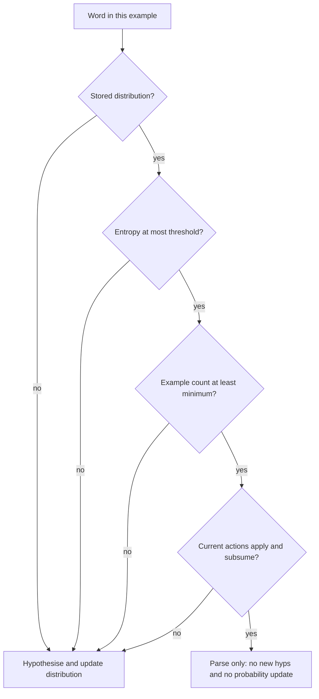

# Parse versus learn

During TTR induction, each word in an example is either **parsed** or **hypothesised**.

Vocabulary means what has already been learned: the seed lexicon, including a lexicon reloaded from a previous run, and any word that already has a distribution in the `WordHypothesisBase`. Words in that vocabulary are revised on later examples until the gate below says to parse. A word with no stored distribution is hypothesised, because entropy and count are undefined.

A word is parse-only for the current example when **all three** conditions hold:

1. **Entropy.** Normalized Shannon entropy of its stored lexical-hypothesis probabilities is at most `model.max_normalized_entropy` (default `0.5`). One positive-probability hypothesis has entropy 0. For `k > 1`, entropy is `(-sum p log p) / log(k)` after renormalizing those probabilities, so the threshold is in `[0, 1]`.
2. **Count.** `WordLogProbDistribution.weight` is at least `model.min_word_count` (default `5`). That weight increments once per training example that updated the word, not once per repeated token inside the example.
3. **Win-stay.** A current lexical action applies on this example and the result still subsumes the target. If entropy and count pass but no current action applies, **fail-search**: hypothesise and update anyway.

Otherwise the word is hypothesised and included in the per-example probability update.

Parse-only means that word gets no new hypotheses on this example and is not passed to `update_dists_end_of_example`, so its count and probabilities stay as they are. Other words in the same sentence are decided on their own.

Probabilities are still blended after each example that updates the word (`update_dists_end_of_example`): discount the prior by `weight/(weight+1)`, run one local EM pass on this example, then add `(1/(weight+1))` times that posterior. `aggregate_distributions` is not used.

Training writes `models/hypothesis-base.json` next to `lexicon-top-N.txt`. Continue-learning (`model.use_previous_model`) loads that file so counts and the full distribution come back. If the lexicon is present and the JSON is not, those words have no counts and are hypothesised. See [induction-pipeline.md](induction-pipeline.md).
